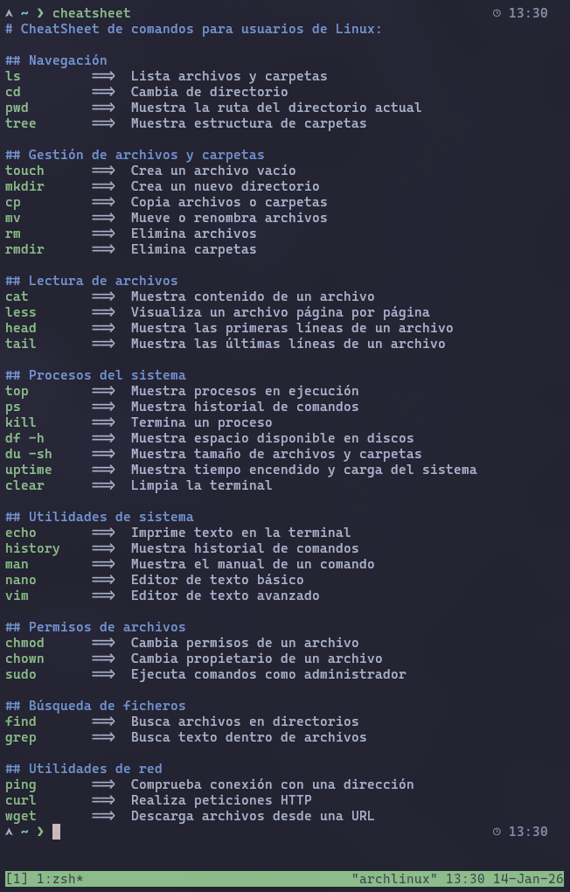

# Node.js cheatsheet for CLI users 

This is a prototype for a CLI tool builded with Node.js that prints on a terminal a cheatsheet with useful linux commands for everyday developer tasks (like 'cd', 'ls', etc.).

## Requirements

- Node.js

## Config

*Steps:*

- open a terminal
- clone this repo and move to it
- install dependencies: `npm install`
- locate your `.zshrc` or `.bashrc` and open it with a text editor 
- create an alias (e.g. `cheatsheet`)
- asign it the next instruction: `node /path/to/index.js`
  - you can get `index.js` path with `pwd` within this project folder
- close and open a new terminal to apply changes 

### Example

- `.zshrc` file:
```zsh
# ...
# ...your .zshrc content
# ...
alias cheatsheet='node /home/matias/repos/cli-cheatsheet-manager/index.js' 
```

## Usage

- just open a terminal and type your new alias (e.g. `cheatsheet`)
- you will see the cheatsheet:


